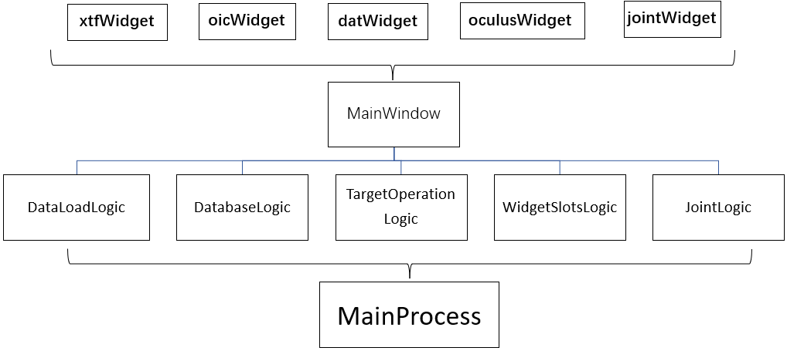
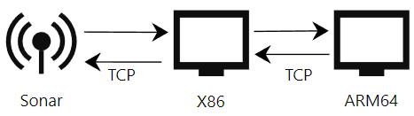

## 前言

非常荣幸能够从2021年9月参与，推动整个项目的从零到2022年11月的最终交付。在这个过程中，我们面临了许多艰巨的挑战，不断迭代和完善各种新的需求，最终客户满意并顺利完成交付。
所有的工作可以大致分为三部分，我和另外两位同门用gitee私仓协作开发，我做的第一部分。

1. 多个协议的前视、侧扫格式数据解析、GUI架构设计、瀑布流实现、增删目标、在线解析
2. 拼接部分：负责声呐图像拼接、航迹线绘制、集成到Qt
3. 检测部分：负责目标检测算法改进、检测目标存储、集成到Qt

### 项目简介

本项目实现了声呐文件解析、瀑布流展示、检测目标、数据库存储、增删目标、图像拼接、航轨线展示等功能。

功能：

- 前视、侧扫版多种格式支持
- 文件解析、加载进度条
- 侧扫声呐实现瀑布流效果
- AI算法检测，将检测到的目标信息存入数据库
- 解析完成后可查看大图，放大、缩小、整个文件
- 漏检目标标注，和误检目标删除
- 支持多文件批量操作
- 支持多种AI算法模型选择
- 支持模型参数设置，比如PR、IOC
- 拼接图像，放大、缩小、平移
- 拼接地图大小自动扩充
- 航轨线显示
- 拼接地图经纬度跳转
- 独立的前视、侧扫开关，优化加载速度
- 大文件切割与存储
- 在线解析
- 窗口大小自适应

## 接手

刚参与项目的时，了解到这个项目在师兄的努力下，已经使用c#搭建了UI个雏形，但缺少核心处理逻辑。和客户的交流后，了解到项目需要使用CV算法。
目前对于跨平台选择方面有些问题：

1. 继续使用C#开发，沿用师兄的UI雏形，需要解决跨平台问题
2. 使用Qt开发，这将能直接使用师兄的C++版本数据解析程序。
3. 使用Pyqt开发，这将能直接调用AI算法，不存在跨语言调用问题。

考虑后续需要接入算法，我提议采用PyQt搭建整个UI。确定好开发方案后，首先就是解析声呐二进制数据实现瀑布流的效果。

## 二进制数据解析

声呐数据的存储格式一直没有统一标准，不同厂家生成的声呐具有不同的协议格式。工业级的声呐都会有极其严格的协议标准，来保证声呐数据的准确性。帧头通常会有几十个数记录经纬度、水文信息、传感器等数据，帧体记录当前帧的声学数据。
要解析这些二进制数据，首先的知道声呐的存储协议。根据协议分析二进制数据，整个协议相当于由C++的结构体堆砌而成。在python中使用[struct模块]([https://www.cnblogs.com/chegnshi-coding/p/4457741.html](https://www.cnblogs.com/chegnshi-coding/p/4457741.html))处理二进制数据，他能够类似C++结构体一样处理二进制数据库。解析的过程也是相当痛苦，因为有的声呐格式并没有协议文档，只有C++解析demo，需要先根据C++程序分解出哪里是校检位？，某段二进制对应的结构体是什么？有协议没demo的则需要根据协议自己构造结构体。
解析完成后，再对图像降噪滤波、灰度矫正、斜距矫正和速度矫正后则进行瀑布流展示。对于多波束的声呐，还需要对声呐数据进行融合修正。这些矫正都有固定的算法来实现，这里不详细展开。其中解析过程中出现了

1. 二进制内存对齐问题
2. 二进制拼接内存泄漏问题
3. 图像处理速度慢问题

## PyQt架构设计

之前一段时间都是采用UI与login不分离的写法，随着功能越来越多，导致程序不好维护。我通过github参考了好几个PyQt开源项目，总结了一套我们能使用的UI与logic分离的模式。在本项目中将不同功能的的widget窗口使用QtDesigner单独绘制。再使用MainWindow集成到一起，让所有的Logic继承MainWindow；最后用MainProcess继承多个Logic。
这样的做优势有以下几点：

- 实现UI与Logic分离，提高了程序的可维护性；
- Widget使用QtDesigner绘制，降低了UI开发难度，节省了开发时间；
- 将功能模块化，减少代码冲突的，提高多人开发效率；
- 每个子模块都能单独运行，提升Debug效率

> 有时候程序直接崩了，并没有指定报错的具体位置的时候，这种Debug方式非常有效。

### 

## 瀑布流

首先是对二进制文件预处理即先解析出ping(帧)的数量和位置，其次具体解析每一ping(帧)的数据，与前面解析好的数据拼接后，最后渲染到UI上。这不是等待彻底解析完成后才加载，而是同时进行的。瀑布流解析完成后，则可以进行滚轮自由滚动。需要注意的目标选框的实现方式、文件的自由滚动实现方式计算都比较繁琐。

### 目标框选实现原理

最开始的目标框选比较简单：
使用一张很大的三维数组来存放整张图像，每解析完成一ping(帧)就赋值到指定位置，如果检测到目标就画完框后对整张图像进行覆盖。再取出要渲染的部分直接渲染。
那么此时就有两个个问题：

1. 如果出现误检需要删除目标就无法实现？
2. 如果此时切换窗口大小，则目标选框，一样会跟着伸缩，选框上的标注也会形变

要解决这样问题则必须画框和瀑布图完全分开。
改进后的方式是：
同样是使用一张很大的三维数组来存放整张图像，每解析完成一ping(帧)就赋值到指定位置。每检测到目标则缓存目标的具体位置。根据要渲染的区域，再绘制目标标注框，需要考虑好滚轮的位置、渲染窗口的大小、图片宽度缩放、目标大小比例转换等因素，这里的计算稍显麻烦。

### 文件的自由滚动实现原理

滚动时，需要根据解析好的大图，计算好目标位置，再一起渲染到UI对应的窗口上，其中需要考虑的因素有

1. 当显示内容不足当前窗口高度时，则需要拼接对应大小的黑色区域
2. 需要计算好当前滚动位置与滚动条位置的像素关系
3. 若是多个文件滚动，则需要考虑前面滚动所有的文件的高度，和当前滚动位置的关系
4. 多文件滚动时，框选目标的计算方式也需要考虑前面滚动的所有文件的高度

## 增删目标

因为AI算法检测容易出现错检、漏检，有时候需要人工标注，进行增删目标，这些操作都需要联动数据库一起增删。
增加目标：首先需要将鼠标在图像渲染窗口中变成'+'，再将x、y轴添加白色虚线。按下鼠标则需要添加对应的回调，绘制矩形框，松开后，则输入目标的ID，确定后，则将目标位置计算出来，添加到数据库，重载窗口。其中涉及到很多问题：

- 绘制时，如何实时变更选框跟随鼠标拖动变大？检测鼠标按下事件、拖动事件，根据鼠标位置计算框的位置，再渲染；
- 绘制后，怎么计算出具体的位置？根据滚轮滑条的位置、计算出当前操作的声呐文件，在计算出是哪一ping(帧)；
- 绘制后如何确定大小？根据当前窗口宽度和原始图像的宽度，做比例换算得出；
- 非法绘制？绘制到当前窗口区域外、两个文件的中间，那就需要提前做条件判断。

删除目标：删除目标，则需要添加鼠标移动事件，需要实时计算当前鼠标所在的区域是否有目标存在，如果有则鼠标呈"手型"，点击后，在数据库删除对应目标，并重载窗口。

## 在线解析

离线解析的方式毕竟实用性有限，本小节介绍的工作是实现声呐数据的在线解析。我调试的这款声呐设备支持网络数据输出，但是必须得用人家的SDK，大致思路是使用厂家SDK驱动声呐，拿到声呐实时数据。看似简单的工作，其实也充满了挑战。我刚分配到这个任务也很忐忑，因为实验室内没人做过声呐数据的在线解析，其中遇到的问题也能自己解决，经过一星期看文档、调试设备和代码后，开辟出一套可行的方案。
可以将这个工作拆解：

1. 看文档学习SDK的正确使用方式

SDK文档是C++版本，Python版本的SDK没有对应文档，后面分析发现，使用ctypes对C++的动态链接库调用，每看一个API就需要去python的SDK程序看一遍封装流程，才能正确使用SDK

2. 确定SDK的正确的工作环境下能否正常工作

这个过程一定要弄明白SDK是X86架构还是ARM，32bit还是64bit，Linux还是window。

3. 确定声呐设备能否正常工作

这个过程也出现过玄学问题，声呐的连接时而好时而坏，困扰好几天，通过控制变量法最终确定是，路由器转发后的那条网线的抗干扰能力不行。

4. 测试SDK在网络环境下是否正确接收到声呐数据。

接收到的是一个C++数据地址，python并不能直接访问这个地址，而要使用`ctypes.string_at(dir,length)`解析指定地址的数据

5. 将会用到的功能封装成对象

经过上面的步骤其实问题已经解决了，但是需要部署在ARM64内核的Linux系统上。由于SDK只支持ARM32和X86内核的Linux上，所以最终使用X86的电脑做TCP转发来解决。

在X86电脑和ARM64电脑上使用Socket将常用命令封装起来，X86作服务端，ARM64作客户端，客户端向服务端发送初始化、设置量程、读取图像等命令。服务端解析后，再使用SDK发送给声呐，并响应给客户端。在这个的过程中使用了简单数据校检，try catch，提高系统稳定性

这个过程中出现问题有：C++内存数据读取问题、TCP粘包问题等

## 总结

这个项目断断续续做了一年多，真正开发集中在前几个月，很大一部分时间都是后期的bug修复。本项目中大部分功能是按照客户需求结合自己想法去实现。比如瀑布流、目标选框的分离、增删目标的位置计算等，这些功能都需要自己去造轮子。这些问题都需要自己去做需求拆分，一步步调试，完成基本功能，再迭代优化。